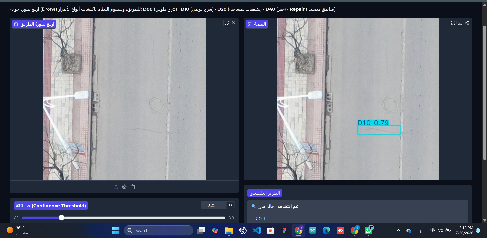
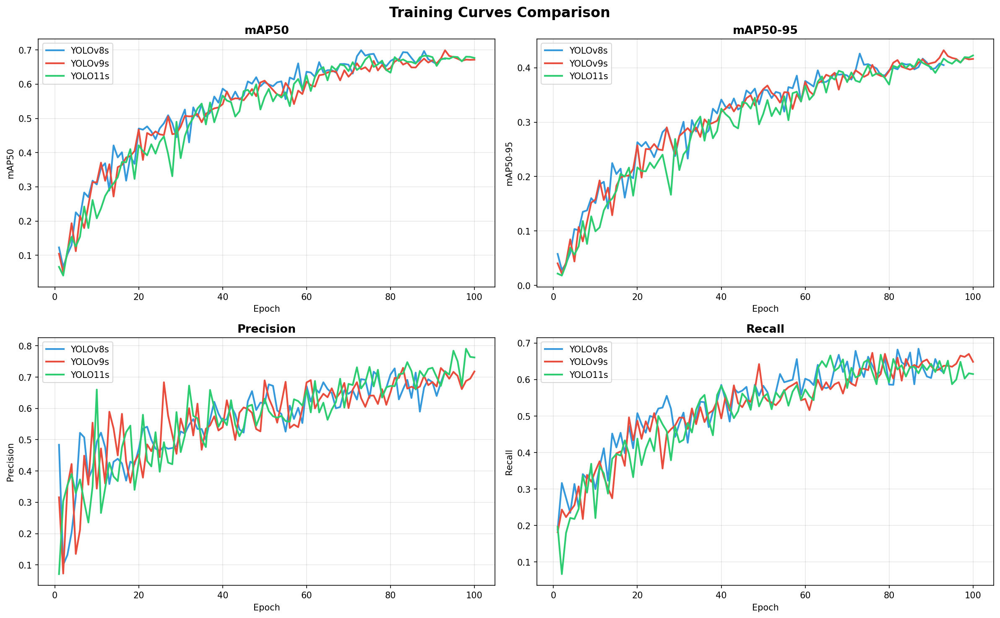
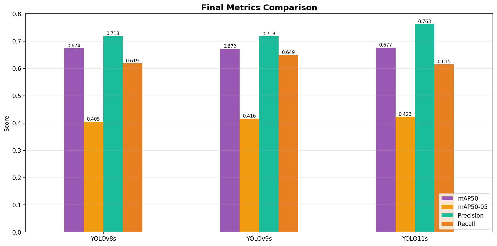
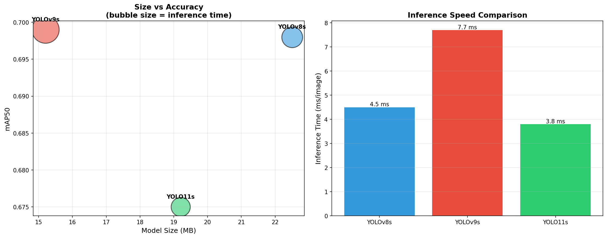
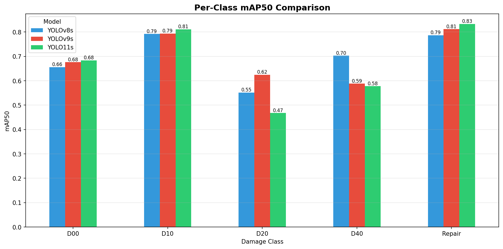

# 🛣️ Road Damage Object Detection

A deep learning pipeline for detecting road surface damage from aerial drone imagery, comparing three state-of-the-art YOLO architectures and deploying the best-performing model as an interactive web app.



---

## 📋 Project Overview

Road infrastructure monitoring is traditionally a manual, time-consuming process. This project explores how computer vision can automate the detection and classification of road damage from drone-captured imagery, comparing multiple YOLO model generations to identify the best trade-off between accuracy, speed, and model size for real-world deployment.

**Key objectives:**
- Train and evaluate **YOLOv8s**, **YOLOv9s**, and **YOLO11s** on the same dataset under identical conditions
- Perform a rigorous, apples-to-apples comparison (same seed, same hyperparameters, same splits)
- Select the best model based on accuracy, inference speed, and model size
- Deploy the selected model as an interactive Gradio web application

---

## 📊 Dataset

**Source:** [RDD2022 — China Drone Subset](https://universe.roboflow.com/ndt-szs8f/rdd2022_china_drone/dataset/1) (Roboflow Universe)

| | |
|---|---|
| Total images | 2,393 (original, no pre-applied augmentation) |
| Train / Valid / Test | 1,673 / 480 / 240 |
| Classes | 5 — `D00` (longitudinal crack), `D10` (transverse crack), `D20` (alligator crack), `D40` (pothole), `Repair` (previously repaired area) |
| Format | YOLO (normalized `.txt` labels) |
| License | CC BY 4.0 |

### Class Distribution (Training Set)

| Class | Count | Share |
|---|---|---|
| D00 | 1,003 | ~30% |
| D10 | 874 | ~26% |
| Repair | 527 | ~16% |
| D20 | 201 | ~6% |
| D40 | 67 | ~2% |

> **Note on class imbalance:** `D40` (potholes) is significantly underrepresented. Interestingly, this did *not* translate into the worst detection performance — potholes have high visual contrast and distinct texture, making them easier to learn even with fewer examples than visually subtler damage types like `D20`.

Augmentation was intentionally **not** pre-applied to the downloaded dataset. Instead, standard YOLO training-time augmentation (mosaic, flip, HSV shift) was used, keeping the raw image count transparent and avoiding double-augmentation.

---

## 🧪 Methodology

All three models were trained under **identical conditions** to ensure a fair comparison:

```python
model.train(
    data="data.yaml",
    epochs=100,
    imgsz=640,
    batch=16,
    patience=20,
    seed=42
)
```

- Same train/valid/test split
- Same image size (640×640)
- Same random seed (42)
- Early stopping with patience=20 (except YOLOv9s, which used the full 100 epochs)
- Transfer learning from COCO-pretrained weights

---

## 📈 Results

### Overall Metrics

| Model | mAP50 | mAP50-95 | Precision | Recall | Params | Size | Inference |
|---|---|---|---|---|---|---|---|
| YOLOv8s | 0.698 | 0.425 | 0.696 | **0.632** | 11.1M | 22.5 MB | 4.5 ms |
| YOLOv9s | **0.699** | **0.432** | 0.715 | 0.638 | **7.3M** | **15.2 MB** | 7.7 ms |
| YOLO11s | 0.675 | 0.421 | **0.766** | 0.615 | 9.4M | 19.2 MB | **3.8 ms** |

### Per-Class mAP50

| Class | YOLOv8s | YOLOv9s | YOLO11s |
|---|---|---|---|
| D00 | 0.656 | 0.676 | **0.684** |
| D10 | 0.792 | 0.794 | **0.811** |
| D20 | 0.552 | **0.625** | 0.468 |
| D40 | **0.703** | 0.588 | 0.578 |
| Repair | 0.787 | 0.812 | **0.833** |






---

## 🏆 Model Selection: YOLO11s

While all three models achieved comparable mAP (within ~2-3% of each other), **YOLO11s** was selected for deployment based on:

1. **Fastest inference** (3.8 ms/image) — critical for real-time or batch processing of drone footage
2. **Highest precision** (0.766) — fewer false positives, which matters for a tool that may inform real-world maintenance decisions
3. **Newest architecture** (C3k2 + C2PSA blocks) with a comparable accuracy ceiling to the older generations
4. Marginal mAP trade-off is an acceptable cost given the speed and precision gains

**Trade-off acknowledged:** YOLOv9s edged out on raw mAP and had the smallest file size, and remains a strong alternative if disk footprint is the primary constraint. YOLOv8s handled the rare `D40` (pothole) class notably better, worth revisiting if pothole detection is the priority use case.

---

## ⚠️ Known Limitation: Domain Generalization

The model was trained exclusively on **aerial (drone, nadir-view)** imagery. During testing, it was confirmed that the model does **not** generalize to **ground-level** photographs (e.g., a phone camera held at road level) — it correctly detects damage on drone-perspective images but produces no detections on ground-level shots of the same road types.

This is an expected and well-documented limitation in computer vision: models trained on one viewing geometry / domain do not automatically transfer to a different one. Extending this project to ground-level imagery would require either:
- Fine-tuning on a mixed-domain dataset, or
- Training a separate model per camera perspective

This limitation is disclosed here transparently rather than glossed over, since understanding a model's boundaries is as important as reporting its strengths.

---

## 🚀 Deployment

A Gradio web app (`app.py`) allows users to upload a drone image and receive:
- Annotated image with bounding boxes and class labels
- A confidence threshold slider
- A detailed detection report (class + confidence per detection)

### Run locally

```bash
pip install -r requirements.txt
python app.py
```

The app will launch on `http://localhost:7860`.

---

## 🗂️ Repository Structure

```
road-damage-detection/
├── README.md
├── requirements.txt
├── app.py                          # Gradio deployment app
├── notebooks/
│   ├── 01_eda.ipynb                # Data exploration & visualization
│   ├── 02_yolov8s_training.ipynb
│   ├── 03_yolov9s_training.ipynb
│   ├── 04_yolo11s_training.ipynb
│   └── 05_model_comparison.ipynb   # Final comparison & selection
├── results/
│   ├── comparison_training_curves.png
│   ├── comparison_final_metrics.png
│   ├── comparison_efficiency.png
│   └── comparison_per_class.png
├── weights/
│   └── best_yolo11s.pt             # Final selected model weights
└── docs/
    └── screenshots/
```

---

## 🛠️ Tech Stack

- **Training:** Ultralytics YOLO (v8s / v9s / v11s), PyTorch, CUDA (Tesla T4)
- **Data:** Roboflow (dataset hosting & version management)
- **Deployment:** Gradio
- **Analysis:** Pandas, Matplotlib

---

## 👤 Author

**Youssef** — SFC Trading

---

## 📄 License

Dataset: CC BY 4.0 (RDD2022 China Drone subset via Roboflow). Code in this repository is provided for portfolio/educational purposes.
